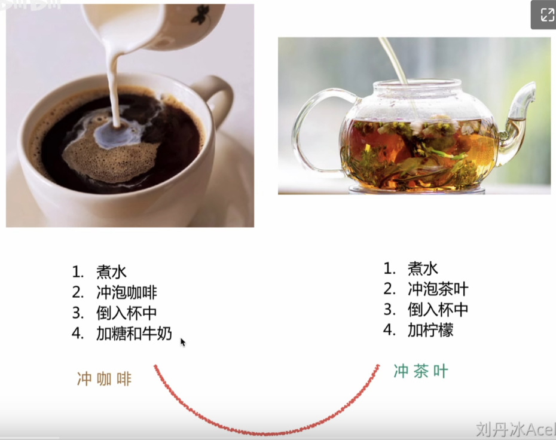
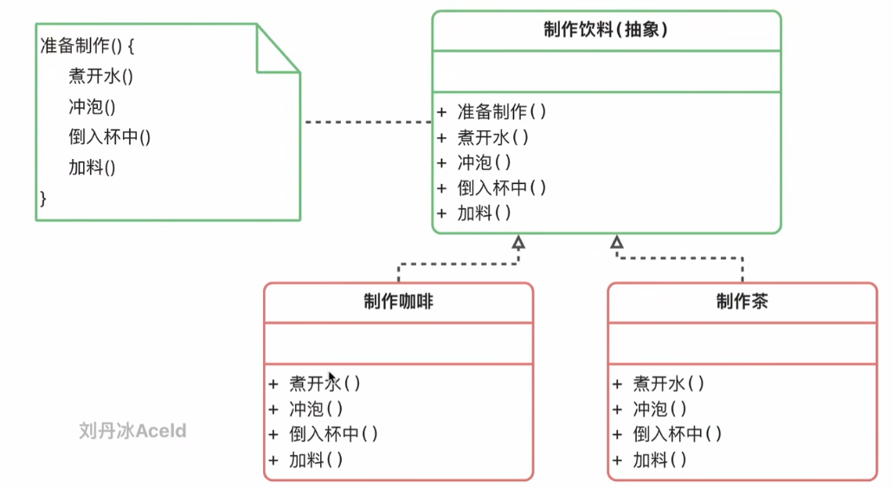

# 适用场景

# 优缺点
优点：

(1) 在父类中形式化地定义一个算法，而由它的子类来实现细节的处理，
在子类实现详细的处理算法时并**不会改变算法中步骤的执行次序**。

(2) 模板方法模式是一种代码复用技术，它在类库设计中尤为重要，它提取了类库中的公共行为，将公共行为放在父类中，而通过其子类来实现不同的行为，它鼓励我们恰当使用继承来实现代码复用。

(3) 可实现一种反向控制结构，通过子类覆盖父类的钩子方法来决定某一特定步骤是否需要执行。

(4) 在模板方法模式中可以通过子类来覆盖父类的基本方法，不同的子类可以提供基本方法的不同实现，更换和增加新的子类很方便，符合单一职责原则和开闭原则。

缺点：

需要为每一个基本方法的不同实现提供一个子类，
**如果父类中可变的基本方法太多，将会导致类的个数增加，系统更加庞大**，设计也更加抽象。

# Reference
- [5.1 模板方法模式](https://www.yuque.com/aceld/lfhu8y/pwepxk)

